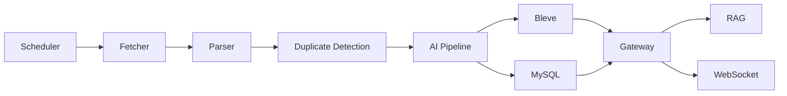

# TechPulse

TechPulse is an AI-powered developer intelligence platform. It collects technical content from RSS and future sources, cleans and deduplicates articles, enriches them with AI summaries, tags, keywords, translations and embeddings, indexes them with Bleve, and exposes search plus RAG chat APIs.

## Architecture



Phase 1 runs the real MVP flow in `cmd/gateway` while keeping packages split for the Phase 2 service decomposition.
Phase 2 adds independently runnable HTTP services for fetch, parse, AI processing, search, RAG, scheduling, and queue workers.

## Features

- RSS feed CRUD and manual fetch
- Real RSS/Atom fetching with timeout and user-agent
- Parser and HTML cleaner
- URL/content hash deduplication
- Mock AI summaries, tags, keywords, translation, and embeddings
- Optional OpenAI-compatible chat provider
- OpenAI-compatible embeddings endpoint support
- Hybrid Bleve + embedding reranking
- Conversation memory for RAG chat
- MySQL persistence
- Bleve full-text search with highlights
- Simple RAG chat with citations
- WebSocket task events at `/ws`
- Docker Compose for MySQL, Redis, RabbitMQ, etcd, MinIO, and services
- Standalone microservice endpoints for Phase 2 service-to-service HTTP calls
- RabbitMQ publisher/consumer implementation for async jobs
- etcd-backed service registry and distributed lock implementation
- OPML import/export, read later, reading history, user prompts, daily reports
- Kubernetes starter manifests and GitHub Actions CI

## Run

```bash
make docker-up
make migrate
make seed
make run
```

Run individual services during Phase 2 development:

```bash
go run ./cmd/scheduler
go run ./cmd/fetcher
go run ./cmd/parser
go run ./cmd/ai-pipeline
go run ./cmd/search
go run ./cmd/rag
go run ./cmd/worker
```

Or build the full stack:

```bash
docker compose -f deploy/docker-compose.yml up -d --build
```

## API Examples

```bash
curl http://localhost:8080/health

curl -X POST http://localhost:8080/api/v1/rss \
  -H "Content-Type: application/json" \
  -d '{"url":"https://go.dev/blog/feed.atom","title":"Go Blog","category":"Go"}'

curl -X POST http://localhost:8080/api/v1/rss/1/fetch

curl "http://localhost:8080/api/v1/search?q=go&page=1&page_size=20"

curl -X POST http://localhost:8080/api/v1/chat \
  -H "Content-Type: application/json" \
  -d '{"question":"What is new in Go?","conversation_id":1}'

curl http://localhost:8080/api/v1/opml

curl -X POST http://localhost:8080/api/v1/prompts \
  -H "Content-Type: application/json" \
  -d '{"name":"release analyst","content":"Focus on breaking changes and migration work.","is_default":true}'

curl -X POST http://localhost:8080/api/v1/daily-reports \
  -H "Content-Type: application/json" \
  -d '{"title":"Today Go"}'
```

## Environment

Copy `.env.example` or export the variables directly. Important defaults:

- `HTTP_PORT=8080`
- `MYSQL_DSN=root:password@tcp(localhost:3306)/techpulse?parseTime=true&charset=utf8mb4&multiStatements=true`
- `AI_PROVIDER=mock`
- `BLEVE_INDEX_PATH=./data/bleve`

## Services

- `cmd/gateway`: REST API, WebSocket, in-process MVP ingestion, search, and RAG.
- `cmd/scheduler`: publishes fetch jobs to RabbitMQ and exposes `/schedule/fetch` plus `/tick`.
- `cmd/fetcher`: exposes `POST /fetch` for RSS and source plugin fetching.
- `cmd/parser`: exposes `POST /parse` for fetched item parsing.
- `cmd/ai-pipeline`: exposes `POST /process` for mock/OpenAI-compatible enrichment.
- `cmd/search`: exposes `POST /index`, `DELETE /index/{id}`, and `/search`.
- `cmd/rag`: exposes `POST /chat` using Bleve retrieval and AI generation.
- `cmd/worker`: migration, seed, and RabbitMQ consumer for fetch, parse, AI, index, and daily report queues.

## Production

- Prometheus-ready endpoint: `GET /metrics`
- Kubernetes starter manifests: `deploy/k8s`
- CI: `.github/workflows/ci.yml`
- Docker Compose validates and runs the full local stack.

## Database

The gateway and worker can create the schema automatically. Tables include users, feeds, articles, tags, article tags, favorites, summaries, translations, embeddings, tasks, conversations, messages, and daily reports. Embeddings are stored as JSON text in the MVP.

## Development

```bash
make test
make build
make lint
make clean
```

## Roadmap

Phase 3-5 add OpenAI-compatible embeddings, hybrid search, conversation memory, OAuth-ready auth URLs, OPML, read later, reading history, user prompts, daily reports, Kubernetes starter manifests, and CI.
