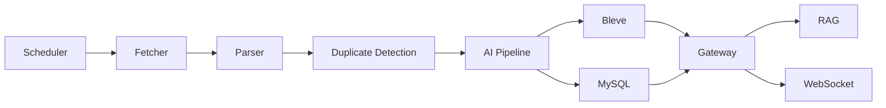

# TechPulse

TechPulse is an AI-powered developer intelligence platform. It collects technical content from RSS and future sources, cleans and deduplicates articles, enriches them with AI summaries, tags, keywords, translations and embeddings, indexes them with Bleve, and exposes search plus RAG chat APIs.

## Architecture



Phase 1 runs the real MVP flow in `cmd/gateway` while keeping packages split for the Phase 2 service decomposition.

## Features

- RSS feed CRUD and manual fetch
- Real RSS/Atom fetching with timeout and user-agent
- Parser and HTML cleaner
- URL/content hash deduplication
- Mock AI summaries, tags, keywords, translation, and embeddings
- Optional OpenAI-compatible chat provider
- MySQL persistence
- Bleve full-text search with highlights
- Simple RAG chat with citations
- WebSocket task events at `/ws`
- Docker Compose for MySQL, Redis, RabbitMQ, etcd, MinIO, and services

## Run

```bash
make docker-up
make migrate
make seed
make run
```

Or build the full stack:

```bash
docker compose -f deploy/docker-compose.yml up -d --build
```

## API Examples

```bash
curl http://localhost:8080/health

curl -X POST http://localhost:8080/api/v1/rss \
  -H "Content-Type: application/json" \
  -d '{"url":"https://go.dev/blog/feed.atom","title":"Go Blog","category":"Go"}'

curl -X POST http://localhost:8080/api/v1/rss/1/fetch

curl "http://localhost:8080/api/v1/search?q=go&page=1&page_size=20"

curl -X POST http://localhost:8080/api/v1/chat \
  -H "Content-Type: application/json" \
  -d '{"question":"What is new in Go?","conversation_id":1}'
```

## Environment

Copy `.env.example` or export the variables directly. Important defaults:

- `HTTP_PORT=8080`
- `MYSQL_DSN=root:password@tcp(localhost:3306)/techpulse?parseTime=true&charset=utf8mb4&multiStatements=true`
- `AI_PROVIDER=mock`
- `BLEVE_INDEX_PATH=./data/bleve`

## Services

- `cmd/gateway`: REST API, WebSocket, in-process MVP ingestion, search, and RAG.
- `cmd/scheduler`: scheduler health service and Phase 2 ticker skeleton.
- `cmd/fetcher`: fetcher health service.
- `cmd/parser`: parser health service.
- `cmd/ai-pipeline`: AI pipeline health service.
- `cmd/search`: search health service.
- `cmd/rag`: RAG health service.
- `cmd/worker`: migration, seed, and queue worker skeleton.

## Database

The gateway and worker can create the schema automatically. Tables include users, feeds, articles, tags, article tags, favorites, summaries, translations, embeddings, tasks, conversations, messages, and daily reports. Embeddings are stored as JSON text in the MVP.

## Development

```bash
make test
make build
make lint
make clean
```

## Roadmap

Phase 2 moves service communication to RabbitMQ and HTTP service clients. Later phases add richer AI providers, hybrid search, OAuth, OPML, delivery integrations, tracing, dashboards, Kubernetes manifests, and load testing.
