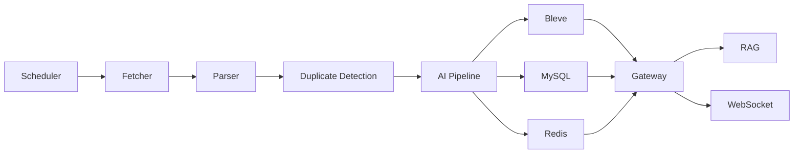

# TechPulse

TechPulse is a Go-based developer knowledge hub. It turns technical RSS/Atom feeds into a searchable AI knowledge base: fetch articles, clean and deduplicate content, generate summaries/tags/embeddings, index with Bleve, and answer questions with citations.

The intentionally strong MVP path is:

```text
Add RSS Feed -> Fetch RSS -> Parse Item -> Deduplicate
-> AI Summary / Tags / Embedding -> Store MySQL -> Index Bleve
-> Search -> RAG Chat with citations -> WebSocket events
```

## Why This Project

Most blog projects are CRUD demos. TechPulse shows backend system design around a real ingestion and retrieval workflow:

- production-style Go package layout
- real RSS/Atom fetching
- MySQL persistence and Redis caching
- full-text search with field boosting and highlights
- pluggable AI provider interface
- simple RAG answer generation with citations
- Docker Compose infrastructure for MySQL, Redis, RabbitMQ, etcd, MinIO, and Go services

## 3-Minute Demo

Start local infrastructure and the gateway:

```bash
make docker-up
make migrate
make seed
make run
```

Run the core flow:

```bash
curl http://localhost:8080/health

curl -X POST http://localhost:8080/api/v1/rss \
  -H "Content-Type: application/json" \
  -d '{"url":"https://go.dev/blog/feed.atom","title":"Go Blog","category":"Go"}'

curl -X POST http://localhost:8080/api/v1/rss/1/fetch

curl "http://localhost:8080/api/v1/search?q=go&page=1&page_size=20"

curl -X POST http://localhost:8080/api/v1/chat \
  -H "Content-Type: application/json" \
  -d '{"question":"What changed recently in Go?","conversation_id":1}'
```

Expected result:

- `/health` returns gateway and Redis status.
- `/rss/1/fetch` returns fetched/inserted/duplicate counts.
- `/search?q=go` returns Bleve hits with snippets and scores.
- `/chat` returns an answer plus article citations.

Example response shapes:

```json
{"status":"ok","service":"gateway","redis":"ok"}
```

```json
{"feed_id":1,"fetched":10,"inserted":8,"duplicates":2}
```

```json
{
  "answer": "Mock answer based on retrieved TechPulse articles...",
  "citations": [
    {"article_id": 1, "title": "Go release notes", "url": "https://go.dev/..."}
  ]
}
```

For a one-command smoke demo:

```bash
make demo
```

## Web UI

A lightweight dashboard is available at [web/dashboard.html](web/dashboard.html). Open it in a browser after the gateway is running. It provides feed management, article fetch, search, article preview, summary, and RAG chat over the REST API.

## Feature Status

| Module | Status | Notes |
| --- | --- | --- |
| RSS / Atom Fetch | Working | Real HTTP fetch with timeout and user-agent |
| Parser / Cleaner | Working | RSS item parsing and simple HTML cleaner |
| URL / Content Hash Dedup | Working | Stable SHA-256 hashes |
| Mock AI Summary / Tags / Embedding | Working | Runs without API keys |
| OpenAI-compatible Provider | Working | Chat + embeddings endpoints |
| Ollama Provider Mode | Working | Uses OpenAI-compatible `/v1` endpoint |
| MySQL Storage | Working | Auto migration on gateway startup |
| Redis Cache | Working | Best-effort cache for hot REST responses |
| Bleve Search | Working | Title/content/summary/tag search, boost, filters, highlight |
| RAG Chat | Basic Working | Retrieves top articles and returns citations |
| WebSocket Events | Working | Emits fetch/index/new article events |
| RabbitMQ / etcd | Partial | Real client implementations, service skeletons |
| GitHub Releases | Stub | Fetcher interface prepared |
| Reddit / Arxiv / YouTube | Stub | Fetcher interface prepared |
| Real GitHub OAuth Callback | Planned | Auth URL is implemented |
| Kubernetes | Starter | Minimal manifests for deployment shape |

## Architecture



Phase 1 runs the core MVP flow in `cmd/gateway`. Phase 2+ exposes independently runnable HTTP services for fetch, parse, AI processing, search, RAG, scheduling, and workers.

## AI Modes

Default local mode:

```env
AI_PROVIDER=mock
```

OpenAI-compatible provider:

```env
AI_PROVIDER=openai
AI_BASE_URL=https://api.openai.com/v1
AI_API_KEY=your-key
AI_MODEL=gpt-4o-mini
```

Local Ollama mode:

```env
AI_PROVIDER=ollama
AI_BASE_URL=http://localhost:11434/v1
AI_MODEL=llama3.1
```

## Commands

```bash
make test
make build
make lint
make docker-up
make migrate
make seed
make run
make demo
```

Run individual services:

```bash
go run ./cmd/scheduler
go run ./cmd/fetcher
go run ./cmd/parser
go run ./cmd/ai-pipeline
go run ./cmd/search
go run ./cmd/rag
go run ./cmd/worker
```

## Important API Examples

```bash
curl http://localhost:8080/api/v1/dashboard
curl "http://localhost:8080/api/v1/favorites?type=read_later"
curl http://localhost:8080/api/v1/opml

curl -X POST http://localhost:8080/api/v1/prompts \
  -H "Content-Type: application/json" \
  -d '{"name":"release analyst","content":"Focus on breaking changes and migration work.","is_default":true}'

curl -X POST http://localhost:8080/api/v1/daily-reports \
  -H "Content-Type: application/json" \
  -d '{"title":"Today Go"}'
```

## Design Notes

Read these first when reviewing the project:

- [Architecture](docs/architecture.md)
- [Design Decisions](docs/design-decisions.md)
- [Search Design](docs/search-design.md)
- [API](docs/api.md)
- [Deployment](docs/deployment.md)

## Known Limitations

- The strongest completed path is RSS -> AI -> Search -> RAG. Non-RSS fetchers are intentionally marked as stubs.
- RabbitMQ and etcd clients are implemented, but the gateway still keeps the MVP path in-process for easy local demo.
- OAuth is not a full login flow yet; the GitHub authorization URL endpoint is present.
- Observability is Prometheus-ready but not a complete tracing stack.

## Resume Summary

```text
TechPulse - AI-powered Developer Knowledge Hub

- Built a Go-based developer intelligence platform that collects RSS/Atom technical articles, deduplicates content by URL/content hash, generates AI summaries/tags/embeddings, and stores articles in MySQL.
- Implemented full-text search with Bleve, including title/content/summary/tag search, field boosting, pagination, filters, and highlight snippets.
- Designed a modular architecture with gateway, fetcher, parser, AI pipeline, search, RAG, scheduler, and worker modules, prepared for microservice decomposition.
- Built a RAG chat API that retrieves relevant articles and returns answers with citations and conversation memory.
- Added Docker Compose environment with MySQL, Redis, RabbitMQ, etcd, MinIO, plus CI checks for build/test/compose validation.
```
