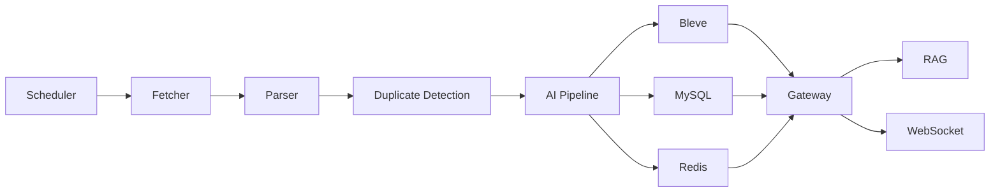

# TechPulse

[English](README.md)

TechPulse 是一个用 Go 构建的 AI 开发者技术情报平台。它可以从 RSS/Atom、GitHub Releases 等来源抓取技术内容，完成解析、清洗、去重、AI 摘要、标签、关键词、向量生成、Bleve 全文搜索，并支持带引用来源的 RAG 问答。

核心 MVP 流程：

```text
添加 RSS 源 -> 抓取 RSS -> 解析文章 -> 去重
-> AI 摘要 / 标签 / Embedding -> 写入 MySQL -> 写入 Bleve 索引
-> 搜索 -> 带引用的 RAG 问答 -> WebSocket 事件推送
```

## 项目价值

TechPulse 不是普通博客 CRUD，而是一个接近真实后端产品的技术信息处理系统，适合用于 Go 后端求职项目展示。

它展示了：

- Go 生产风格分层目录结构
- 真实 RSS/Atom 抓取
- Feed 创建、更新、删除、启停、测试、抓取频率、OPML 导入导出
- 文章已读、收藏、稍后读、归档、删除
- GitHub Releases 抓取
- GitHub OAuth 回调和用户写入
- SMTP 邮件发送测试邮件和日报
- MySQL 持久化和 Redis 缓存
- Bleve 全文搜索、字段权重、过滤、高亮
- 可插拔 AI Provider
- 带引用来源的 RAG 问答
- Docker Compose 一键启动 MySQL、Redis、RabbitMQ、etcd、MinIO 和 Go 服务

## 3 分钟演示

启动本地依赖和 gateway：

```bash
make docker-up
make migrate
make seed
make run
```

打开 Web UI：

```text
http://localhost:8080/
http://localhost:8080/dashboard
```

核心 API 流程：

```bash
curl http://localhost:8080/health

curl -X POST http://localhost:8080/api/v1/rss \
  -H "Content-Type: application/json" \
  -d '{"url":"https://go.dev/blog/feed.atom","title":"Go Blog","category":"Go","fetch_interval_minutes":360}'

curl -X POST http://localhost:8080/api/v1/rss/1/test
curl -X POST http://localhost:8080/api/v1/rss/1/fetch

curl "http://localhost:8080/api/v1/search?q=go&tag=Go&source=rss&page=1&page_size=20"

curl -X POST http://localhost:8080/api/v1/chat \
  -H "Content-Type: application/json" \
  -d '{"question":"最近 Go 有什么重要更新？","conversation_id":1}'

curl -X POST http://localhost:8080/api/v1/github/releases/fetch \
  -H "Content-Type: application/json" \
  -d '{"url":"https://github.com/golang/go"}'
```

## Web UI

Tailwind Dashboard 由 gateway 直接提供：

- 登录页：`http://localhost:8080/login`
- 中文登录页：`http://localhost:8080/login/zh`
- 英文版：`http://localhost:8080/`
- 中文版：`http://localhost:8080/zh`
- 中文 Dashboard：`http://localhost:8080/dashboard/zh`

页面支持：

- RSS Feed 添加、测试、抓取、启用、禁用、删除
- GitHub Releases 抓取
- 文章搜索、标签过滤、摘要查看
- 已读、收藏、归档、删除
- RAG 问答
- 每日技术日报生成

## 功能状态

| 模块 | 状态 | 说明 |
| --- | --- | --- |
| Feed 管理 | 已完成 | 创建、更新、删除、启停、测试、抓取频率、OPML |
| RSS / Atom 抓取 | 已完成 | 真实 HTTP 抓取、超时、User-Agent |
| GitHub Releases | 已完成 | 抓取 release 标题、tag、正文、作者、发布时间 |
| Parser / Cleaner | 已完成 | RSS item 解析和 HTML 清洗 |
| URL / 内容 Hash 去重 | 已完成 | 稳定 SHA-256 hash |
| Mock AI 摘要 / 标签 / Embedding | 已完成 | 无需 API Key 即可运行 |
| OpenAI 兼容 Provider | 已完成 | Chat 和 Embedding 接口 |
| Ollama 模式 | 已完成 | 使用 OpenAI 兼容 `/v1` 接口 |
| MySQL 存储 | 已完成 | gateway 启动时自动建表 |
| Redis 缓存 | 已完成 | 热点 REST 响应的尽力缓存 |
| 文章管理 | 已完成 | 列表、详情、阅读历史、收藏、稍后读、归档、删除 |
| Bleve 搜索 | 已完成 | 标题、正文、摘要、标签、来源、日期过滤、高亮 |
| RAG 问答 | 基础可用 | 检索相关文章并返回引用 |
| WebSocket 事件 | 已完成 | 抓取、索引、新文章事件推送 |
| 登录 / GitHub OAuth | 基础可用 | 登录页、Auth URL、callback、GitHub 用户 upsert |
| 邮件发送 | 基础可用 | SMTP 测试邮件和日报发送 |
| RabbitMQ / etcd | 部分完成 | 真实客户端和服务骨架 |
| Reddit / Arxiv / YouTube | 预留 | Fetcher 接口已准备 |
| Kubernetes | 起步完成 | 基础部署清单 |

## 架构



Phase 1 在 `cmd/gateway` 中跑通完整 MVP。Phase 2+ 提供 fetcher、parser、AI pipeline、search、RAG、scheduler、worker 等独立服务入口。

## AI 模式

默认本地模式：

```env
AI_PROVIDER=mock
```

OpenAI 兼容模式：

```env
AI_PROVIDER=openai
AI_BASE_URL=https://api.openai.com/v1
AI_API_KEY=your-key
AI_MODEL=gpt-4o-mini
```

本地 Ollama 模式：

```env
AI_PROVIDER=ollama
AI_BASE_URL=http://localhost:11434/v1
AI_MODEL=llama3.1
```

## 常用命令

```bash
make test
make build
make lint
make docker-up
make migrate
make seed
make run
make demo
```

单独运行服务：

```bash
go run ./cmd/scheduler
go run ./cmd/fetcher
go run ./cmd/parser
go run ./cmd/ai-pipeline
go run ./cmd/search
go run ./cmd/rag
go run ./cmd/worker
```

## 设计文档

- [架构](docs/architecture.zh-CN.md)
- [设计决策](docs/design-decisions.zh-CN.md)
- [搜索设计](docs/search-design.zh-CN.md)
- [API](docs/api.zh-CN.md)
- [部署](docs/deployment.zh-CN.md)
- [数据库](docs/database.zh-CN.md)
- [路线图](docs/roadmap.zh-CN.md)

## 已知限制

- 最强路径是 RSS/GitHub Releases -> AI -> Search -> RAG。Reddit、Arxiv、YouTube、HackerNews 仍是扩展预留。
- RabbitMQ 和 etcd 客户端已实现，但 gateway 为了本地演示仍保留进程内 MVP 流程。
- OAuth 已支持 GitHub URL、callback、用户 upsert，Session/JWT 鉴权仍是后续增强。
- SMTP 邮件已实现，但需要配置环境变量后才会启用。
- Observability 已具备 Prometheus 基础结构，还不是完整 tracing 方案。

## 简历描述

```text
TechPulse - AI-powered Developer Knowledge Hub

- 使用 Go 构建开发者技术情报平台，支持 RSS/Atom 技术文章采集、URL/内容 hash 去重、AI 摘要/标签/embedding 生成，并将文章持久化到 MySQL。
- 实现 GitHub Releases 采集，将开源项目 release notes 接入同一套 AI/Search/RAG 处理链路。
- 实现 GitHub OAuth callback 和 SMTP 邮件日报发送。
- 基于 Bleve 实现全文搜索，支持标题/正文/摘要/标签检索、字段权重、分页、过滤和高亮。
- 设计 gateway、fetcher、parser、AI pipeline、search、RAG、scheduler、worker 模块化架构，方便后续拆分微服务。
- 构建 RAG Chat API，能够检索相关文章并返回带引用来源的回答和会话记忆。
- 提供 Docker Compose 环境，包含 MySQL、Redis、RabbitMQ、etcd、MinIO，以及 build/test/compose 校验。
```
