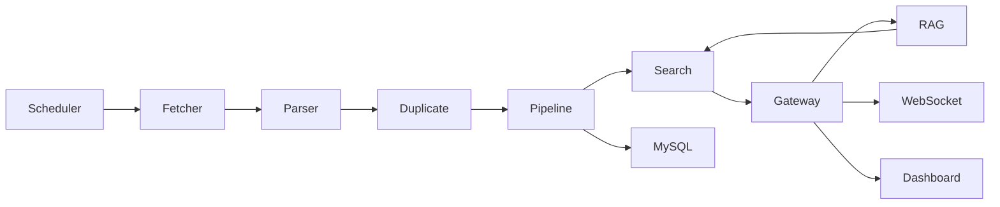

# Architecture

TechPulse is organized as a Go monorepo with independently runnable service entrypoints under `cmd/`.

Phase 1 runs the real MVP path in the gateway process. The service packages are split so Phase 2 can move scheduler, fetcher, parser, AI pipeline, search, RAG, and worker behind HTTP or RabbitMQ boundaries.
