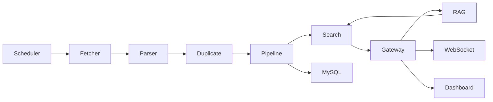

# 架构

TechPulse 是一个 Go monorepo。每个主要服务入口都放在 `cmd/` 下，可以独立运行。

Phase 1 在 gateway 进程内跑通真实 MVP 路径。Phase 2 将 scheduler、fetcher、parser、AI pipeline、search、RAG、worker 暴露为可以独立运行的服务。

服务通信方式：

- HTTP：fetcher `/fetch`、parser `/parse`、ai-pipeline `/process`、search `/index` 和 `/search`、rag `/chat`
- RabbitMQ：`fetch`、`parse`、`ai`、`index`、`daily_report` 队列
- etcd：服务注册路径 `/techpulse/services/*`，分布式锁路径 `/techpulse/locks/*`
- Redis：缓存热点 REST 响应和服务状态。Redis 不可用时 gateway 自动回退到 MySQL/Bleve
- 混合检索：Bleve 负责关键词召回，配置 AI Provider 后可以使用 embedding 对 Top Hits 重排
- RAG 记忆：conversation 和 message 存在 MySQL，最近对话会注入生成 prompt
